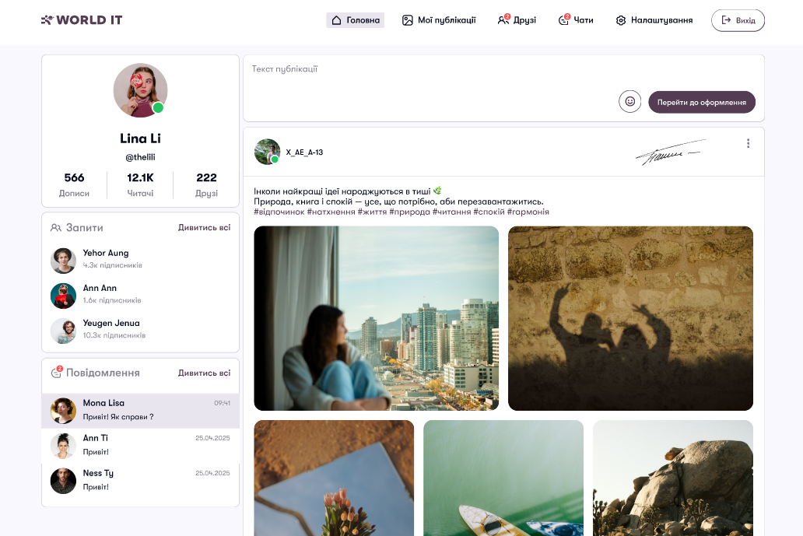
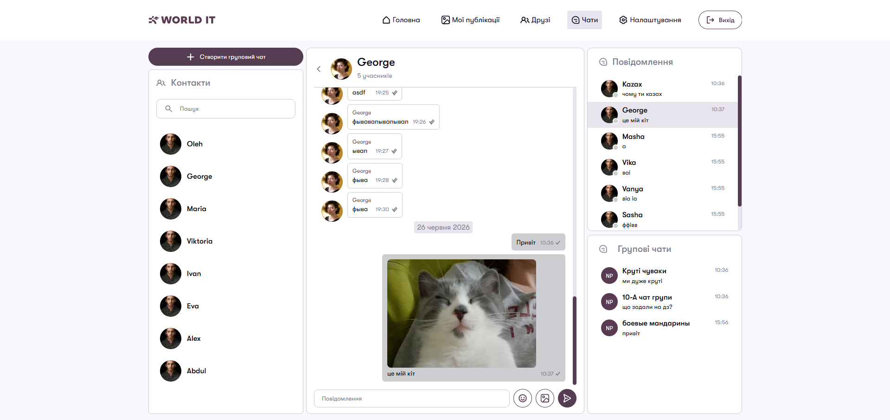
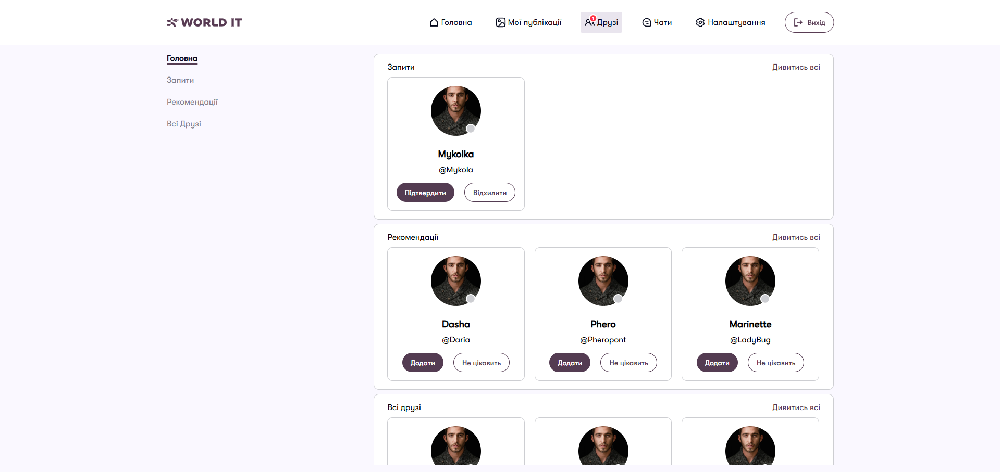
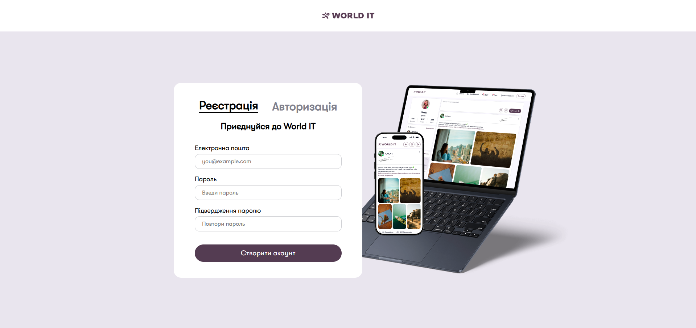
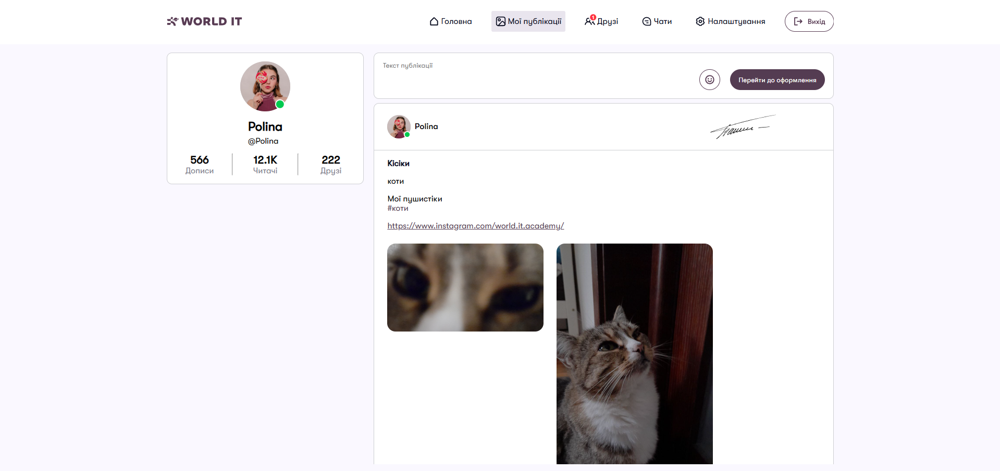

<h1 align = "center">Social Network</h1>

<h2>Language(Мова): </h2> 
<ul>
    <li>
        <h3><a href="#english">English</a></h3>
    </li>
    <li>
        <h3><a href="#ukrainian">Українська</a></h3>
    </li>
</ul>

<h2 id="english" align = "center">English</h2>

The main aim of the project is to improve programming skills using the  <strong>Django framework</strong>, learn how to use WebSocket requests, and develop an interactive social network with real-time data exchange, which automates interaction between users without the need to reload pages. This project implements:

<ul>
    <li>Database architecture and form processing</li>
    <li>Login, registration and changing users password</li>
    <li>Real-time two-way communication for instant messaging in chat rooms</li>
    <li>Asynchronous HTTP requests to the backend for dynamic content updates</li>
    <li>A flexible and minimalist interface</li>
</ul>

<h2>Contents:</h2>
<ul>
    <li><a href="#team">Team</a></li>
    <li><a href="#modules">Modules</a></li>
    <li><a href="#structure">Structure</a></li>
    <li><a href="#start-project">Launch</a></li>
    <li><a href="#conclusions">Conclusions</a></li>
</ul>

<h2 id="team">Team:</h2>
<ul>
    <li><a href="https://github.com/PolynkoPolina">Polynko Polina</a> — teamleader, main developer</li>
    <li><a href="https://github.com/GeorgeGrod">George Grodskiy</a> — developer</li>
    <li><a href="https://github.com/OlehNedilko">Oleh Nedilko</a> — developer</li>
</ul>

<h2 id="modules">Modules</h2>
<ul>
    <li><a href="https://www.djangoproject.com/">Django</a> — the main framework on which the project is built</li>
    <li><a href="https://github.com/django/daphne/">Daphne</a> — an ASGI server for receiving requests and passing them on in Python</li>
    <li><a href="https://pillow.readthedocs.io/en/stable/">Pillow</a> — allows you to upload, resize and crop images, apply filters or convert file formats</li>
    <li><a href="https://tzdata.python.org/">Tzdata</a> — a package containing a database of time zones</li>
</ul>

<h2 id="#structure">Structure</h2>

The project consists of the following main apps:

<ul>
    <li><b>social_network</b>— the main project folder. This is where the main project settings are stored</li>
    <li><b>chat</b> — this app handles the logic of real-time messaging between users
    
    </li>
    <li><b>user</b> — this app stores all user data.
    
    It is also responsible for user registration and authorisation. 
    
    </li>
    <li><b>post</b> — this app handles the logic for creating, editing and displaying user posts.
    
    </li>
    <li><b>home</b> — this app displays the home page and all posts on the network.
    
    </li>
</ul>

<h2 id="start-project">Launch</h2>
<ol>
    <li>Clone project onto your PC: <pre><code>git clone https://github.com/PolynkoPolina/Social-Network.git</code></pre></li>
    <li>Create and activate a virtual environment (venv) in the project folder: <ul>
            <li>For Windows:</li>
            <pre><code>python -m venv venv
source venv/Scripts/activate</code></pre>
            <li>For MacOS and Linux:</li>
            <pre><code>python3 -m venv venv
source venv/bin/activate</code></pre>
        </ul>
    </li>
    <li>Install all the required modules using the file <b>requirements.txt:</b> <ul>
            <li>For Windows:</li>
            <pre><code>pip install -r requirements.txt</code></pre>
            <li>For MacOS and Linux:</li>
            <pre><code>pip3 install -r requirements.txt</code></pre>
        </ul></li>
    <li>Launch the project: <pre><code>python social-network/manage.py runserver</code></pre></li>
</ol>
<h6>To run the project, you will also need to create a file called <code>.env</code> and set up an email address to which the authorisation code will be sent</h6>

<h2 id = "conclusions">Conclusions</h2>

As a result of the project, the following skills have been developed and improved:

<ul>
    <li>The Django framework</li>
    <li>SQL database tables</li>
    <li>The Daphne ASGI server and asynchronous requests</li>
</ul>

<h2 id="ukrainian" align = "center">Українська</h2>

Основною метою проєкту є вдосконалення навичок програмування на фреймворці <strong>Django</strong>, навчитися коистуватися WebSocket запитами та розробити інтерактивну соціальну мережу з підтримкою миттєвого обміну даними, яка автоматизує взаємодію між користувачами без необхідності перезавантаження сторінок. В цьому проєкті реалізовані:

<ul>
    <li>Архітектура бази даних та обробку форм</li>
    <li>Авторизація, реєстрація та зміна паролю користувача</li>
    <li>Двосторонній зв'язок у реальному часі для миттєвого обміну повідомленнями в чатах</li>
    <li>Асинхронні HTTP-запити до бекенду для динамічного оновлення контенту</li>
    <li>Гнучкий та мінімалістичний інтерфейс</li>
</ul>

<h2>Зміст:</h2>
<ul>
    <li><a href="#teamukr">Команда</a></li>
    <li><a href="#modulesukr">Модулі</a></li>
    <li><a href="#structureukr">Структура</a></li>
    <li><a href="#start-projectukr">Запуск</a></li>
    <li><a href="#conclusionsukr">Висновки</a></li>
</ul>

<h2 id="teamukr">Команда:</h2>
<ul>
    <li><a href="https://github.com/PolynkoPolina">Полинько Поліна</a> — тімлідер, головна розробниця</li>
    <li><a href="https://github.com/GeorgeGrod">Георгій Гродський</a> — розробник</li>
    <li><a href="https://github.com/OlehNedilko">Олег Неділько</a> — розробник</li>
</ul>

<h2 id="modulesukr">Модулі проєкту</h2>
<ul>
    <li><a href="https://www.djangoproject.com/">Django</a> — основний фреймворк, на якому зроблений проєкт</li>
    <li><a href="https://github.com/django/daphne/">Daphne</a> — asgi-сервер для приймання запитів та передавання їх у python</li>
    <li><a href="https://pillow.readthedocs.io/en/stable/">Pillow</a> — дозволяє завантажувати, змінювати розміри, обрізати картинки, накладати фільтри чи конвертувати формати</li>
    <li><a href="https://tzdata.python.org/">Tzdata</a> — пакет, що містить базу даних часових поясів</li>
</ul>

<h2 id="#structureukr">Структура</h2>

Проєкт складається з таких основних папок:

<ul>
    <li>
        <b>social_network</b>— основна папка проєкту. В ньому зберігаються головні налаштування проєкту
    </li>
    <li>
        <b>chat</b> — застосунок чату. В ньому здійснюється логіка переписки користувачів в реальному часі
        
    </li>
    <li>
        <b>user</b> — застосунок користувача/ки. В ньому зберігаються всі дані про юзерів.
        
        Він також відповідає за регістрацію та авторизацію користувачів
        
    </li>
    <li>
        <b>post</b> — застосунок постів. В ньому здійснюється логіка створення, редагування, та відображення користувацьких постів.
        
    </li>
    <li>
        <b>home</b> — застосунок головної сторінки. В ньому здійснюється відображеня головної сторінки та усіх постів мережі.
        
    </li>
</ul>

<h2 id="start-projectukr">Запуск проєкту</h2>
<ol>
    <li>Склонуйте проєкт на ваш ПК: <pre><code>git clone https://github.com/PolynkoPolina/Social-Network.git</code></pre></li>
    <li>Створіть та активуйте віртуальне оточення(venv) у папці проєкта: <ul>
            <li>Для Windows:</li>
            <pre><code>python -m venv venv
source venv/Scripts/activate</code></pre>
            <li>Для MacOS та Linux:</li>
            <pre><code>python3 -m venv venv
source venv/bin/activate</code></pre>
        </ul>
    </li>
    <li>Встановіть всі потрібні модулі за допомогою файлу <b>requirements.txt:</b> <ul>
            <li>Для Windows:</li>
            <pre><code>pip install -r requirements.txt</code></pre>
            <li>Для MacOS та Linux:</li>
            <pre><code>pip3 install -r requirements.txt</code></pre>
        </ul></li>
    <li>Запустість проєкт: <pre><code>python social-network/manage.py runserver</code></pre></li>
</ol>
<h6>Також для запуску проєкту вам треба створити файл <code>.env</code> та пошту для відправлення коду для авторизації</h6>

<h2 id = "conclusionsukr">Висновки</h2>

У результаті розробки проєкту розвинулись та покращились такі навички роботи з:

<ul>
    <li>Фреймворком Django</li>
    <li>Таблицями баз даних SQL</li>
    <li>ASGI-сервером Daphne та асинхронними запитами</li>
</ul>